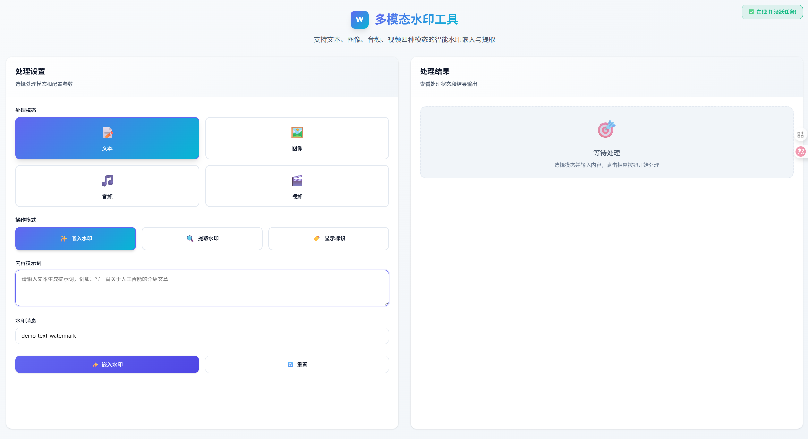

# AI-Generated Content Identification Toolkit

<div align="center">
  <!-- Project logo placeholder - need logo image -->
  <!-- <a href="https://github.com/your-repo-link">
    
  </a> -->

  <h3 align="center">AI-Generated Content Identification Toolkit</h3>

  <p align="center">
    A one-stop open-source identification technology development kit supporting visible marking, invisible marking, and watermarking for text, image, audio, and video content
    <br />
    <a href="#usage"><strong>Quick Start »</strong></a>
    <br />
    <br />
    <a href="pictures/watermark.mp4">Live Demo</a>
    ·
    <a href="https://github.com/your-repo-link/issues">Report Bug</a>
    ·
    <a href="https://github.com/your-repo-link/issues">Request Feature</a>
  </p>
</div>

<!-- TABLE OF CONTENTS -->
<details>
  <summary>Table of Contents</summary>
  <ol>
    <li>
      <a href="#about-the-project">About The Project</a>
      <ul>
        <li><a href="#built-with">Built With</a></li>
      </ul>
    </li>
    <li>
      <a href="#getting-started">Getting Started</a>
      <ul>
        <li><a href="#prerequisites">Prerequisites</a></li>
        <li><a href="#installation">Installation</a></li>
      </ul>
    </li>
    <li><a href="#usage">Usage</a></li>
    <li><a href="#web-demo">Web Demo</a></li>
    <li><a href="#api-reference">API Reference</a></li>
    <li><a href="#performance">Performance</a></li>
    <li><a href="#roadmap">Roadmap</a></li>
    <li><a href="#contributing">Contributing</a></li>
    <li><a href="#license">License</a></li>
    <li><a href="#contact">Contact</a></li>
    <li><a href="#acknowledgments">Acknowledgments</a></li>
  </ol>
</details>

## About The Project

<!-- Project screenshot placeholder - need web interface screenshot -->
<!-- [![Product Screenshot][product-screenshot]](https://example.com) -->

This toolkit provides a one-stop open-source identification technology development kit. It supports four major modalities: text, image, audio, and video, with capabilities for visible marking, invisible marking, and watermarking, comprehensively covering the identification scope stipulated by GB 45438-2025 "Cybersecurity Technology - Identification Methods for Artificially Generated and Synthesized Content".

### Why Choose This Toolkit?

- **Comprehensive Coverage**: Supports all identification methods required by GB 45438-2025 standard
- **Multi-Modal Support**: Unified processing for text, image, audio, and video content
- **Dual-Mode Operations**: Both AI content generation and existing file processing capabilities
- **Production Ready**: Complete with web interface, batch processing, and performance optimization


### Built With

* [![Python][Python.org]][Python-url]
* [![PyTorch][PyTorch.org]][PyTorch-url]
* [![Flask][Flask.palletsprojects.com]][Flask-url]
* [![Transformers][Transformers-badge]][Transformers-url]
* [![Diffusers][Diffusers-badge]][Diffusers-url]

<p align="right">(<a href="#readme-top">back to top</a>)</p>

## Getting Started

### Prerequisites

- Python 3.8 or higher
- CUDA-capable GPU (recommended for optimal performance)
- FFmpeg (required for video processing)

### Installation

1. Clone the repository
   ```bash
   git clone https://github.com/your-repo-link/unified_watermark_tool.git
   cd unified_watermark_tool
   ```

2. Install core dependencies
   ```bash
   pip install -r requirements.txt
   ```

3. Install modality-specific dependencies (optional)
   ```bash
   # For text watermarking
   pip install -r src/text_watermark/credid/watermarking/MPAC/requirements.txt

   # For image watermarking (PRC backend)
   pip install -r src/image_watermark/PRC-Watermark/requirements.txt

   # For audio watermarking
   pip install torch torchaudio julius soundfile librosa scipy matplotlib

   # For advanced audio features (Bark TTS)
   pip install git+https://github.com/suno-ai/bark.git
   ```

4. Configure environment (optional for offline mode)
   ```bash
   export TRANSFORMERS_OFFLINE=1
   export HF_HUB_OFFLINE=1
   export HF_ENDPOINT=https://hf-mirror.com  # For Chinese users
   ```

<p align="right">(<a href="#readme-top">back to top</a>)</p>

## Usage

### Quick Start

#### Invisible Watermarking

```python
from src.unified.watermark_tool import WatermarkTool

# Initialize the tool
tool = WatermarkTool()

# Text invisible watermarking 
watermarked_text = tool.embed("Please introduce AI-generated content", "my_message", 'text')
result = tool.extract(watermarked_text, 'text')

# Image invisible watermarking
img = tool.embed("a cat under the sun", "img_watermark", 'image')

# Audio invisible watermarking 
audio = tool.embed("Hello world", "audio_watermark", 'audio',
                   output_path="output.wav")

# Video invisible watermarking
video = tool.embed("The sun shines on the sea", "video_watermark", 'video')
```

#### Visible Marking 
```python
from src.utils.visible_mark import (
    add_text_mark_to_text,
    add_overlay_to_image,
    add_overlay_to_video_ffmpeg,
    add_voice_mark_to_audio
)
from PIL import Image

# Text visible marking
original_text = "This is an example text content."
marked_text = add_text_mark_to_text(
    original_text,
    mark="本内容由人工智能生成",
    position="start"
)

# Image visible marking
img = Image.open("input.jpg")
marked_img = add_overlay_to_image(
    img,
    "本内容由人工智能生成",
    position="bottom_right",
    font_percent=4.0,
    font_color="#FFFF00"
)

# Video visible marking
marked_video_path = add_overlay_to_video_ffmpeg(
    "input.mp4",
    "output.mp4",
    "本内容由人工智能生成",
    position="bottom_right",
    font_percent=3.0,
    duration_seconds=3.0
)

# Audio visible marking (voice annotation)
marked_audio_path = add_voice_mark_to_audio(
    "input.wav",
    "output.wav",
    "本内容由人工智能生成",
    position="start",
    voice_preset="v2/zh_speaker_6"
)
```

### Running the Web Interface

```bash
# Start the Flask server
python app.py

# Open browser and navigate to
# http://localhost:5000
```

### Advanced Configuration

Edit configuration files in the `config/` directory:

- `config/default_config.yaml`: Global settings for all modalities
- `config/text_config.yaml`: Text watermarking specific settings

#### Configuration Example

```yaml
# Text watermarking configuration
text_watermark:
  algorithm: "credid"                    # CredID algorithm for LLM text watermarking
  mode: "lm"                             # LM mode (language model, higher quality)
  credid:
    watermark_key: "default_key"          # Watermark key identifier
    lm_params:
      delta: 1.5                         # Logits modification strength (watermark strength)
      prefix_len: 10                     # Prefix length for context analysis
      message_len: 10                    # Watermark message length in bits
    wm_params:
      encode_ratio: 8                    # Encoding ratio (tokens per watermark bit)

# Image watermarking configuration
image_watermark:
  algorithm: "videoseal"                 # VideoSeal algorithm (default) or "prc"
  resolution: 512                       # Image resolution for AI generation mode
  num_inference_steps: 30                # Inference steps (higher = better quality)
  guidance_scale: 7.5                    # Guidance scale (higher = more prompt adherence)
  videoseal:
    replicate: 32                        # Multi-frame replication for enhanced detection
    chunk_size: 16                       # Processing chunk size for efficiency

# Audio watermarking configuration
audio_watermark:
  algorithm: "audioseal"                 # AudioSeal algorithm for audio watermarking
  sample_rate: 16000                     # Required sample rate for AudioSeal (16kHz)
  message_bits: 16                       # Watermark message length in bits
  audioseal:
    nbits: 16                           # Message encoding bits (SHA256-based)
    alpha: 1.0                          # Watermark strength adjustment

# Video watermarking configuration
video_watermark:
  watermark: "videoseal"                 # VideoSeal watermarking algorithm
  videoseal:
    lowres_attenuation: true             # Enable low-resolution optimization
    chunk_size: 16                       # Processing chunk size for large videos
```

<p align="right">(<a href="#readme-top">back to top</a>)</p>

## Web Demo



The toolkit includes a comprehensive web interface featuring:

### 🎨 Interface Features
- **Dual-Column Layout**: Operations panel on the left, results display on the right
- **Mode Switching**: Toggle between "AI Generation" and "Upload File" modes
- **Identification Method Selection**: Choose between "Invisible Watermarking" and "Visible Marking"
- **Real-time Comparison**: Side-by-side display of original vs processed content
- **Multi-format Support**: Handles all major image, audio, and video formats

### 🚀 Supported Operations

| Modality | Invisible Watermarking | Visible Marking | File Upload Support |
|----------|----------------------|-----------------|-------------------|
| **Text** | ✅ CredID  | ✅ Text annotation | ❌ (Generate only) |
| **Image** | ✅ VideoSeal  | ✅ Overlay marking | ✅ Multi-format |
| **Audio** | ✅ AudioSeal  | ✅ Voice annotation | ✅ Multi-format |
| **Video** | ✅  VideoSeal | ✅ Overlay marking | ✅ Auto-transcoding |


<p align="right">(<a href="#readme-top">back to top</a>)</p>

## API Reference

### Core API

#### Invisible Watermarking API

```python
# Embedding invisible watermarks
result = tool.embed(
    prompt="content or prompt",           # Text content or generation prompt
    message="watermark_message",          # Watermark to embed
    modality="text|image|audio|video",    # Content type
    **kwargs                              # Modality-specific parameters
)

# Extracting invisible watermarks
detection = tool.extract(
    content,                              # Watermarked content
    modality="text|image|audio|video",    # Content type
    **kwargs                              # Detection parameters
)
```

#### Visible Marking API

```python
from src.utils.visible_mark import *

# Add visible marks to different modalities
marked_text = add_text_mark_to_text(text, mark, position)
marked_image = add_overlay_to_image(image, text, position, font_percent)
marked_video_path = add_overlay_to_video_ffmpeg(input_path, output_path, text)
marked_audio_path = add_voice_mark_to_audio(input_path, output_path, mark_text)
```

### REST API Endpoints

```bash
# Invisible watermark embedding
POST /api/watermark/<modality>

# Visible marking
POST /api/visible_mark

# Task status checking
GET /api/status/<task_id>

# File serving
GET /api/files/<task_id>/original
GET /api/files/<task_id>/watermarked
```

<p align="right">(<a href="#readme-top">back to top</a>)</p>

<!-- ## Performance

### Benchmarks

#### Invisible Watermarking Performance

| Operation | Processing Time | Quality Metrics | Success Rate |
|-----------|----------------|-----------------|--------------|
| **Text Generation** | ~2-5s per 100 tokens | N/A | 100% |
| **Image Processing** | ~1-10s per image | PSNR >30dB | 100% |
| **Audio Embedding** | 0.93s per second | SNR 44.45dB | 100% |
| **Audio Extraction** | 0.04s per second | Correlation >0.95 | 100% |
| **Video Generation** | ~3s per 13 frames | High quality | 100% |
| **Batch Processing** | 2.8s for 3 audio files | SNR >40dB | 100% |

#### Visible Marking Performance

| Operation | Processing Time | Quality Metrics | Compliance |
|-----------|----------------|-----------------|------------|
| **Text Annotation** | <0.01s | Readable overlay | GB 45438-2025 |
| **Image Overlay** | 0.1-0.5s per image | Anti-aliased text | GB 45438-2025 |
| **Video Overlay** | Real-time via FFmpeg | Professional quality | GB 45438-2025 |
| **Audio Voice Mark** | 3-8s (TTS generation) | Natural speech | GB 45438-2025 | -->


<!-- <p align="right">(<a href="#readme-top">back to top</a>)</p> -->

## Roadmap

- [x] **Invisible Watermarking Implementation**
  - [x] CredID text watermarking
  - [x] VideoSeal image/video watermarking
  - [x] AudioSeal audio watermarking
  - [x] PRC-Watermark alternative backend

- [x] **Visible Marking Implementation**
  - [x] Text content annotation
  - [x] Image overlay marking
  - [x] Video overlay marking (FFmpeg)
  - [x] Audio voice annotation (Bark TTS)

- [x] **Web Interface**
  - [x] Dual-mode support (AI generation + file upload)
  - [x] Identification method selection (invisible/visible)
  - [x] Real-time comparison display
  - [x] Responsive design
  - [x] Browser-compatible media transcoding

- [x] **Compliance & Standards**
  - [x] GB 45438-2025 compliance
  - [x] Standard marking text templates
  - [x] Configurable positioning and styling
  - [x] Multi-modal unified approach

- [ ] **Future Enhancements**
  - [ ] Additional watermarking algorithms
  - [ ] Mobile app interface
  - [ ] Cloud deployment options
  - [ ] Advanced analytics dashboard
  - [ ] Multi-language support for UI

See the [open issues](https://github.com/your-repo-link/issues) for a full list of proposed features and known issues.

<p align="right">(<a href="#readme-top">back to top</a>)</p>

<!-- ## Contributing

Contributions are what make the open source community such an amazing place to learn, inspire, and create. Any contributions you make are **greatly appreciated**.

<p align="right">(<a href="#readme-top">back to top</a>)</p>

## License

Distributed under the [LICENSE_TYPE] License. See `LICENSE` for more information.

<p align="right">(<a href="#readme-top">back to top</a>)</p>

## Contact

<!-- Contact information needed 
Your Name - [@your_twitter](https://twitter.com/your_username) - email@example.com

Project Link: [https://github.com/your-repo-link/unified_watermark_tool](https://github.com/your-repo-link/unified_watermark_tool)

<p align="right">(<a href="#readme-top">back to top</a>)</p> -->

## Acknowledgments

* [Meta AudioSeal](https://github.com/facebookresearch/audioseal) - Audio watermarking algorithm
* [VideoSeal](https://github.com/facebookresearch/videoseal) - Video watermarking technology
* [Bark TTS](https://github.com/suno-ai/bark) - Text-to-speech synthesis
* [HunyuanVideo](https://huggingface.co/hunyuanvideo-community/HunyuanVideo) - Text-to-video generation
* [Hugging Face](https://huggingface.co) - Model hosting and transformers library
* [PyTorch](https://pytorch.org) - Deep learning framework

<p align="right">(<a href="#readme-top">back to top</a>)</p>

<!-- MARKDOWN LINKS & IMAGES -->
[Python.org]: https://img.shields.io/badge/Python-3776AB?style=for-the-badge&logo=python&logoColor=white
[Python-url]: https://python.org/
[PyTorch.org]: https://img.shields.io/badge/PyTorch-EE4C2C?style=for-the-badge&logo=pytorch&logoColor=white
[PyTorch-url]: https://pytorch.org/
[Flask.palletsprojects.com]: https://img.shields.io/badge/Flask-000000?style=for-the-badge&logo=flask&logoColor=white
[Flask-url]: https://flask.palletsprojects.com/
[Transformers-badge]: https://img.shields.io/badge/🤗%20Transformers-FFD700?style=for-the-badge
[Transformers-url]: https://huggingface.co/transformers/
[Diffusers-badge]: https://img.shields.io/badge/🧨%20Diffusers-FF6B6B?style=for-the-badge
[Diffusers-url]: https://huggingface.co/docs/diffusers/