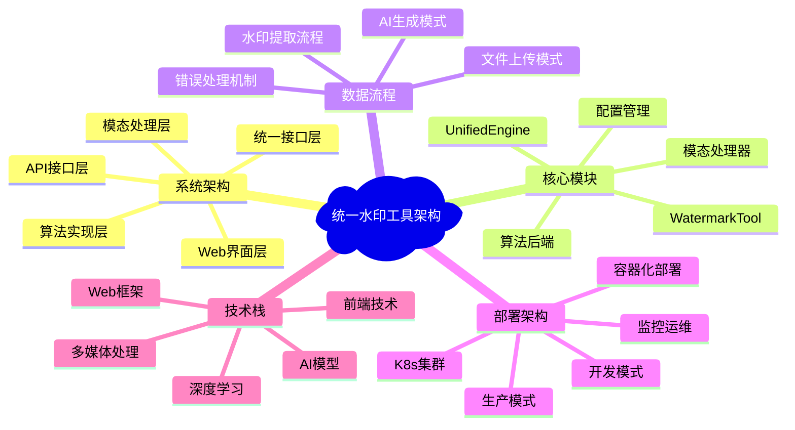

# 统一水印工具 - 架构文档

## 概述

本目录包含了统一水印工具的完整架构设计文档，通过多个维度的架构图全面展示了系统的设计思路、技术选型和实施方案。

## 架构文档索引

### 1. [系统整体架构](./system_architecture.md)
展示系统的5层架构设计，包括Web界面层、API接口层、统一接口层、模态处理层和算法实现层的完整结构。

**核心内容**：
- 📋 5层架构设计原理
- 🔄 模块间的依赖关系  
- 🎯 设计原则和特色功能
- 💡 懒加载和离线优先策略

### 2. [核心模块关系图](./core_modules.md)
深入分析系统核心模块的详细关系，展示各个组件如何协作完成多模态水印操作。

**核心内容**：
- 🏗️ 统一接口层设计
- 🔀 模态处理器架构
- 🧠 AI模型集成方案
- 🔧 配置和支持系统
- 🎨 关键设计模式应用

### 3. [数据流程架构](./data_flow.md)
详细描述数据在系统中的流转过程，包括AI生成模式、文件上传模式和水印提取的完整数据流。

**核心内容**：
- 🎨 AI生成模式流程
- 📁 文件上传模式流程  
- 🔍 水印提取流程
- 📊 时序图详细说明
- ⚡ 关键处理节点分析

### 4. [部署架构设计](./deployment_architecture.md)
从开发到生产环境的完整部署方案，包括容器化、Kubernetes和监控运维策略。

**核心内容**：
- 🏠 开发/生产部署模式
- 🐳 容器化部署方案
- ☁️ Kubernetes集群配置
- 📊 监控和运维策略
- 💾 资源配置建议

### 5. [技术栈架构](./technology_stack.md)
全面展示项目使用的技术栈，从前端到后端、从AI模型到部署工具的完整技术选型。

**核心内容**：
- 🌐 前端技术栈
- 🐍 Python生态系统
- 🧠 深度学习框架
- 🎯 AI模型技术栈
- 🔒 水印算法栈
- 🛠️ 开发和部署工具

## 快速导航

## 核心设计理念

### 🎯 统一化设计 (Unified Design)
- **统一API**: 所有模态使用相同的`embed()`和`extract()`接口
- **统一配置**: 集中化的YAML配置管理
- **统一错误处理**: 一致的异常处理和降级策略

### 🔄 模块化架构 (Modular Architecture)  
- **松耦合**: 各模态独立实现，便于维护和扩展
- **可插拔**: 支持运行时算法切换（如VideoSeal/PRC）
- **分层设计**: 清晰的层次结构，职责分明

### ⚡ 性能优化 (Performance Optimization)
- **懒加载**: 按需初始化组件，节省内存
- **离线优先**: 优先使用本地缓存模型
- **设备自适应**: CPU/CUDA自动检测和优化

### 🛡️ 可靠性保障 (Reliability Assurance)
- **双模式支持**: AI生成和文件上传模式无缝切换
- **原文件保存**: 自动保存原文件和水印文件用于对比
- **智能降级**: 模型不可用时的自动回退机制

## 系统特色功能

### 🎨 多模态水印支持
- **文本水印**: CredID多方水印框架，支持LLM输出标识
- **图像水印**: VideoSeal/PRC双后端，支持生成和上传模式
- **音频水印**: AudioSeal深度学习算法 + Bark TTS集成
- **视频水印**: HunyuanVideo生成 + VideoSeal水印嵌入

### 🌐 Web界面特色
- **实时状态**: 任务处理实时状态更新
- **对比显示**: 原文件vs水印文件并排对比
- **拖拽上传**: 现代化的文件上传体验
- **响应式设计**: 支持桌面和移动设备

### 🔧 开发友好特性
- **类型提示**: 完整的Python类型注解
- **详细文档**: 丰富的代码注释和使用说明
- **测试覆盖**: 全面的单元测试和集成测试
- **配置驱动**: 灵活的YAML配置管理

## 架构演进路线

### 📅 当前版本 (v1.0)
- ✅ 完整的多模态水印支持
- ✅ Web界面和API接口
- ✅ 离线优先和模型缓存
- ✅ Docker容器化支持

### 🚀 未来规划 (v2.0)
- 🔄 异步任务队列（Celery集成）
- 📊 更丰富的监控和指标
- 🔍 更多水印算法支持
- ⚡ 性能优化和加速

### 🌟 长期愿景 (v3.0+)
- 🧠 AI驱动的智能水印选择
- 🌍 分布式计算支持
- 🔒 更强的安全和隐私保护
- 📱 移动端原生应用

## 贡献指南

### 📖 文档贡献
1. 补充具体实现细节
2. 添加使用案例和最佳实践
3. 更新架构图和流程图
4. 完善API文档和示例

### 🔧 代码贡献
1. 遵循现有的架构设计原则
2. 保持模块间的松耦合
3. 添加完整的测试覆盖
4. 更新相关文档

### 🐛 问题报告
1. 使用Issue模板描述问题
2. 提供复现步骤和环境信息
3. 附上相关日志和错误信息
4. 建议可能的解决方案

---

## 联系信息

如有疑问或建议，请通过以下方式联系：

- 📧 提交Issue到项目仓库
- 💬 在讨论区发起话题
- 📝 提交Pull Request贡献代码

感谢您对统一水印工具项目的关注和支持！