# 统一水印工具 - 核心模块关系图

## 核心模块关系架构图

```mermaid
graph TB
    %% 用户入口
    USER[用户/开发者] --> |使用| TOOL

    %% 统一接口层
    subgraph "统一接口层"
        TOOL[WatermarkTool<br/>高级API封装]
        ENGINE[UnifiedWatermarkEngine<br/>核心引擎]
        TOOL --> |委托| ENGINE
    end

    %% 模态处理器
    subgraph "模态处理器"
        TEXT_WM[TextWatermark<br/>CredIDWatermark]
        IMAGE_WM[ImageWatermark<br/>双后端支持]
        AUDIO_WM[AudioWatermark<br/>AudioSeal + Bark]
        VIDEO_WM[VideoWatermark<br/>HunyuanVideo + VideoSeal]
    end

    %% 引擎连接模态处理器
    ENGINE --> |lazy load| TEXT_WM
    ENGINE --> |lazy load| IMAGE_WM
    ENGINE --> |lazy load| AUDIO_WM
    ENGINE --> |lazy load| VIDEO_WM

    %% 图像水印后端
    subgraph "图像水印后端"
        VIDEOSEAL_IMG[VideoSealImageWatermark<br/>默认后端]
        PRC_WM[PRCWatermark<br/>可选后端]
    end

    IMAGE_WM --> |algorithm=videoseal| VIDEOSEAL_IMG
    IMAGE_WM --> |algorithm=prc| PRC_WM

    %% CredID文本水印框架
    subgraph "CredID框架"
        CREDID_CORE[CredID核心算法]
        CREDID_MULTI[多方水印支持]
        CREDID_ECC[纠错码机制]
    end

    TEXT_WM --> CREDID_CORE
    CREDID_CORE --> CREDID_MULTI
    CREDID_CORE --> CREDID_ECC

    %% AudioSeal框架
    subgraph "AudioSeal框架"
        AUDIOSEAL_GEN[AudioSeal生成器]
        AUDIOSEAL_DET[AudioSeal检测器]
        BARK_TTS[Bark TTS生成器]
    end

    AUDIO_WM --> AUDIOSEAL_GEN
    AUDIO_WM --> AUDIOSEAL_DET
    AUDIO_WM --> |AI生成模式| BARK_TTS

    %% VideoSeal核心算法
    subgraph "VideoSeal核心"
        VIDEOSEAL_CORE[VideoSeal算法核心]
        VIDEOSEAL_EMBED[水印嵌入器]
        VIDEOSEAL_DETECT[水印检测器]
    end

    VIDEOSEAL_IMG --> VIDEOSEAL_CORE
    VIDEO_WM --> VIDEOSEAL_CORE
    VIDEOSEAL_CORE --> VIDEOSEAL_EMBED
    VIDEOSEAL_CORE --> VIDEOSEAL_DETECT

    %% HunyuanVideo生成器
    subgraph "HunyuanVideo生成"
        HUNYUAN_GEN[HunyuanVideo生成器]
        HUNYUAN_PIPE[Diffusers Pipeline]
        HUNYUAN_TRANS[Transformer3D模型]
    end

    VIDEO_WM --> |AI生成模式| HUNYUAN_GEN
    HUNYUAN_GEN --> HUNYUAN_PIPE
    HUNYUAN_PIPE --> HUNYUAN_TRANS

    %% 配置管理系统
    subgraph "配置管理系统"
        CONFIG_MGR[配置管理器]
        DEFAULT_CONFIG[default_config.yaml]
        TEXT_CONFIG[text_config.yaml]
        VIDEO_CONFIG[video_config.yaml]
    end

    ENGINE --> CONFIG_MGR
    CONFIG_MGR --> DEFAULT_CONFIG
    CONFIG_MGR --> TEXT_CONFIG
    CONFIG_MGR --> VIDEO_CONFIG

    %% 模型管理系统
    subgraph "模型管理系统"
        MODEL_MGR[全局模型管理器]
        HF_CACHE[HuggingFace缓存]
        LOCAL_MODELS[本地模型存储]
        DEVICE_MGR[设备管理器]
    end

    TEXT_WM --> MODEL_MGR
    IMAGE_WM --> MODEL_MGR
    AUDIO_WM --> MODEL_MGR
    VIDEO_WM --> MODEL_MGR

    MODEL_MGR --> HF_CACHE
    MODEL_MGR --> LOCAL_MODELS
    MODEL_MGR --> DEVICE_MGR

    %% 工具支持模块
    subgraph "工具支持模块"
        VIDEO_UTILS[视频处理工具]
        AUDIO_UTILS[音频处理工具]
        IMAGE_UTILS[图像处理工具]
        TRANSCODER[视频转码器]
    end

    VIDEO_WM --> VIDEO_UTILS
    VIDEO_WM --> TRANSCODER
    AUDIO_WM --> AUDIO_UTILS
    IMAGE_WM --> IMAGE_UTILS

    %% 样式定义
    classDef userLayer fill:#e3f2fd,stroke:#0277bd,stroke-width:3px
    classDef unifiedLayer fill:#fff8e1,stroke:#f57c00,stroke-width:2px
    classDef modalityLayer fill:#fce4ec,stroke:#c2185b,stroke-width:2px
    classDef backendLayer fill:#f1f8e9,stroke:#388e3c,stroke-width:2px
    classDef algorithmLayer fill:#ffebee,stroke:#d32f2f,stroke-width:2px
    classDef configLayer fill:#e8eaf6,stroke:#3f51b5,stroke-width:2px
    classDef supportLayer fill:#f9fbe7,stroke:#827717,stroke-width:2px

    class USER userLayer
    class TOOL,ENGINE unifiedLayer
    class TEXT_WM,IMAGE_WM,AUDIO_WM,VIDEO_WM modalityLayer
    class VIDEOSEAL_IMG,PRC_WM backendLayer
    class CREDID_CORE,CREDID_MULTI,CREDID_ECC,AUDIOSEAL_GEN,AUDIOSEAL_DET,BARK_TTS,VIDEOSEAL_CORE,VIDEOSEAL_EMBED,VIDEOSEAL_DETECT,HUNYUAN_GEN,HUNYUAN_PIPE,HUNYUAN_TRANS algorithmLayer
    class CONFIG_MGR,DEFAULT_CONFIG,TEXT_CONFIG,VIDEO_CONFIG,MODEL_MGR,HF_CACHE,LOCAL_MODELS,DEVICE_MGR configLayer
    class VIDEO_UTILS,AUDIO_UTILS,IMAGE_UTILS,TRANSCODER supportLayer
```

## 核心模块详细说明

### 统一接口层

#### WatermarkTool (高级API封装)
- **功能**: 提供简单易用的高级API接口
- **特点**: 向后兼容，支持批处理，算法切换
- **主要方法**: 
  - `embed()`: 统一的水印嵌入接口
  - `extract()`: 统一的水印提取接口
  - `set_algorithm()`: 运行时算法切换

#### UnifiedWatermarkEngine (核心引擎)
- **功能**: 多模态水印操作的核心协调器
- **特点**: 懒加载机制，配置驱动，离线优先
- **主要职责**: 
  - 模态路由分发
  - 配置参数管理
  - 错误处理和降级

### 模态处理层

#### TextWatermark (CredIDWatermark)
- **支持模式**: 仅AI生成模式
- **核心算法**: CredID多方水印框架
- **特点**: 支持多LLM供应商，隐私保护设计

#### ImageWatermark (双后端支持)
- **支持模式**: AI生成模式 + 文件上传模式
- **默认后端**: VideoSeal (将图像视作单帧视频处理)
- **可选后端**: PRC-Watermark (伪随机纠错码水印)
- **特点**: 运行时后端切换，检测增强支持

#### AudioWatermark (AudioSeal + Bark)
- **支持模式**: AI生成模式(Bark TTS) + 文件上传模式
- **核心算法**: Meta AudioSeal深度学习水印
- **TTS集成**: Bark多语言文本转语音
- **特点**: 16位消息编码，高保真嵌入(SNR>40dB)

#### VideoWatermark (HunyuanVideo + VideoSeal)
- **支持模式**: AI生成模式(HunyuanVideo) + 文件上传模式
- **生成模型**: HunyuanVideo Diffusers Pipeline
- **水印算法**: VideoSeal 256位视频水印
- **特点**: 浏览器兼容转码，内存优化策略

### 配置和支持系统

#### 配置管理系统
- **分层配置**: 全局配置 + 模态特定配置
- **动态加载**: 支持运行时配置更新
- **参数优化**: 基于测试验证的最优默认参数

#### 模型管理系统
- **全局管理器**: 统一的模型加载和缓存管理
- **离线优先**: 优先使用本地缓存，支持完全离线运行
- **设备自适应**: CPU/CUDA自动检测和张量设备管理

#### 工具支持模块
- **多媒体处理**: 视频、音频、图像格式转换和处理
- **转码支持**: 浏览器兼容的媒体格式转码
- **I/O工具**: 文件读写和批处理支持

## 关键设计模式

### 1. 策略模式 (Strategy Pattern)
- **ImageWatermark**: 动态选择VideoSeal或PRC后端
- **各模态处理器**: 统一接口，不同实现策略

### 2. 工厂模式 (Factory Pattern)
- **模型管理器**: 根据配置创建相应的模型实例
- **处理器工厂**: 根据模态类型创建处理器

### 3. 懒加载模式 (Lazy Loading)
- **引擎初始化**: 按需加载模态处理器，节省内存
- **模型加载**: 首次使用时才加载深度学习模型

### 4. 适配器模式 (Adapter Pattern)
- **VideoSeal图像适配**: 将图像适配为单帧视频处理
- **配置适配器**: 统一不同格式的配置文件访问

### 5. 观察者模式 (Observer Pattern)
- **任务状态管理**: Web界面实时更新处理状态
- **进度回调**: 长耗时操作的进度通知机制