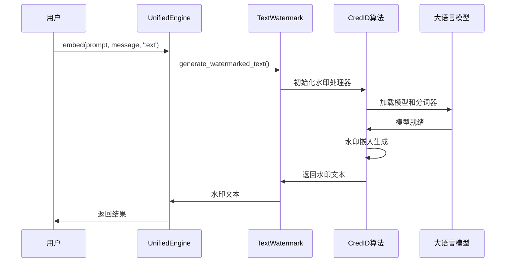
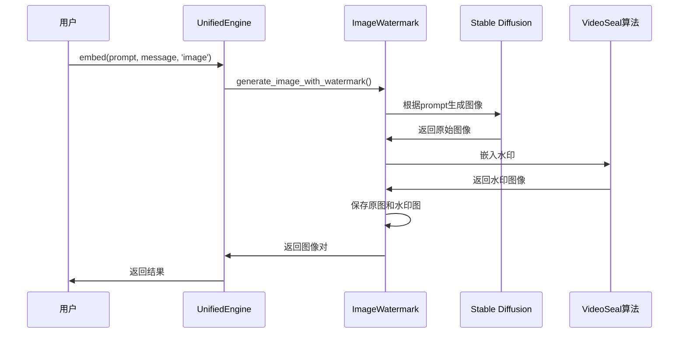
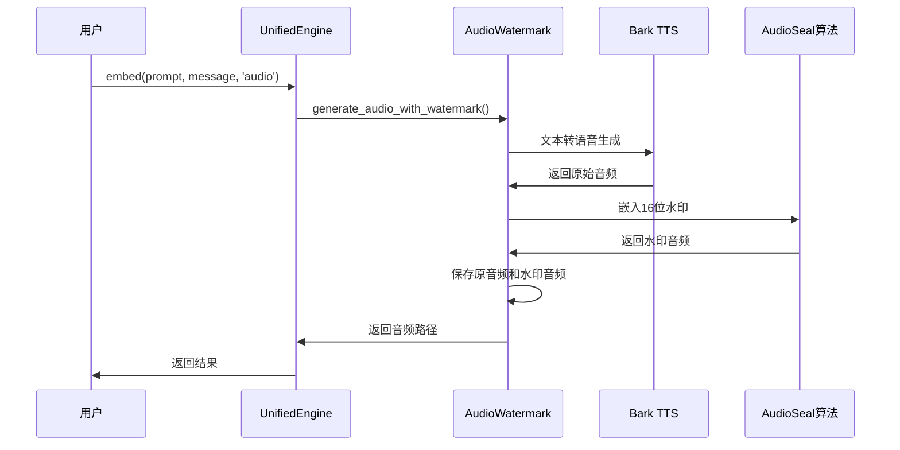
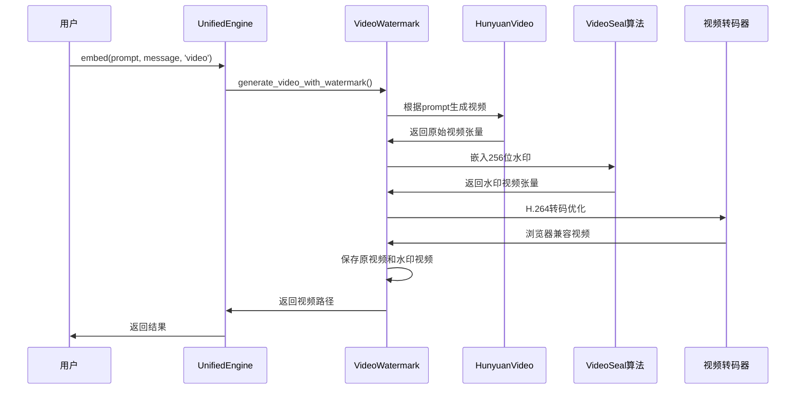

# 统一水印工具 - 数据流程架构

## 完整数据流程图

```mermaid
flowchart TD
    %% 用户输入
    USER[用户输入] --> MODE_SELECT{选择模式}
    
    %% 模式选择
    MODE_SELECT --> |AI生成模式| AI_MODE[AI生成内容]
    MODE_SELECT --> |上传文件模式| UPLOAD_MODE[上传现有文件]

    %% AI生成模式流程
    subgraph "AI生成模式数据流"
        AI_MODE --> MODALITY_SELECT{选择模态}
        
        %% 文本生成流程
        MODALITY_SELECT --> |文本| TEXT_PROMPT[输入文本提示]
        TEXT_PROMPT --> TEXT_GEN[LLM文本生成<br/>+ CredID水印嵌入]
        TEXT_GEN --> TEXT_OUTPUT[水印文本输出]
        
        %% 图像生成流程
        MODALITY_SELECT --> |图像| IMAGE_PROMPT[输入图像提示]
        IMAGE_PROMPT --> IMAGE_GEN[Stable Diffusion<br/>图像生成]
        IMAGE_GEN --> IMAGE_WATERMARK[VideoSeal/PRC<br/>水印嵌入]
        IMAGE_WATERMARK --> IMAGE_OUTPUT[原图 + 水印图]
        
        %% 音频生成流程
        MODALITY_SELECT --> |音频| AUDIO_PROMPT[输入音频提示]
        AUDIO_PROMPT --> BARK_TTS[Bark TTS<br/>语音生成]
        BARK_TTS --> AUDIO_WATERMARK[AudioSeal<br/>水印嵌入]
        AUDIO_WATERMARK --> AUDIO_OUTPUT[原音频 + 水印音频]
        
        %% 视频生成流程
        MODALITY_SELECT --> |视频| VIDEO_PROMPT[输入视频提示]
        VIDEO_PROMPT --> HUNYUAN_GEN[HunyuanVideo<br/>视频生成]
        HUNYUAN_GEN --> VIDEO_WATERMARK[VideoSeal<br/>水印嵌入]
        VIDEO_WATERMARK --> VIDEO_TRANSCODE[H.264转码<br/>浏览器兼容]
        VIDEO_TRANSCODE --> VIDEO_OUTPUT[原视频 + 水印视频]
    end

    %% 上传文件模式流程
    subgraph "上传文件模式数据流"
        UPLOAD_MODE --> FILE_UPLOAD[文件上传]
        FILE_UPLOAD --> FILE_VALIDATE{文件验证}
        FILE_VALIDATE --> |验证通过| FILE_PROCESS[文件预处理]
        FILE_VALIDATE --> |验证失败| UPLOAD_ERROR[上传错误]
        
        FILE_PROCESS --> FILE_MODALITY{检测模态类型}
        
        %% 图像文件处理
        FILE_MODALITY --> |图像文件| IMG_FILE_WM[VideoSeal/PRC<br/>水印嵌入]
        IMG_FILE_WM --> IMG_FILE_OUTPUT[原图 + 水印图]
        
        %% 音频文件处理
        FILE_MODALITY --> |音频文件| AUDIO_FILE_RESAMPLE[采样率检查<br/>和重采样]
        AUDIO_FILE_RESAMPLE --> AUDIO_FILE_WM[AudioSeal<br/>水印嵌入]
        AUDIO_FILE_WM --> AUDIO_FILE_OUTPUT[原音频 + 水印音频]
        
        %% 视频文件处理
        FILE_MODALITY --> |视频文件| VIDEO_FILE_WM[VideoSeal<br/>水印嵌入]
        VIDEO_FILE_WM --> VIDEO_FILE_TRANSCODE[H.264转码<br/>浏览器兼容]
        VIDEO_FILE_TRANSCODE --> VIDEO_FILE_OUTPUT[原视频 + 水印视频]
    end

    %% 水印提取流程
    subgraph "水印提取数据流"
        EXTRACT_INPUT[水印内容输入] --> EXTRACT_MODALITY{检测模态类型}
        
        %% 文本水印提取
        EXTRACT_MODALITY --> |文本| TEXT_EXTRACT[CredID水印提取<br/>+ 多方投票机制]
        TEXT_EXTRACT --> TEXT_RESULT[检测结果<br/>{detected, message, confidence}]
        
        %% 图像水印提取
        EXTRACT_MODALITY --> |图像| IMAGE_EXTRACT[VideoSeal/PRC<br/>水印检测]
        IMAGE_EXTRACT --> IMAGE_ENHANCE{启用检测增强?}
        IMAGE_ENHANCE --> |是| IMAGE_REPLICATE[多帧复制<br/>replicate + chunk_size]
        IMAGE_ENHANCE --> |否| IMAGE_DIRECT[直接检测]
        IMAGE_REPLICATE --> IMAGE_RESULT[检测结果<br/>{detected, message, confidence}]
        IMAGE_DIRECT --> IMAGE_RESULT
        
        %% 音频水印提取
        EXTRACT_MODALITY --> |音频| AUDIO_EXTRACT[AudioSeal<br/>水印检测]
        AUDIO_EXTRACT --> AUDIO_DECODE[16位消息解码<br/>+ 智能匹配]
        AUDIO_DECODE --> AUDIO_RESULT[检测结果<br/>{detected, message, confidence}]
        
        %% 视频水印提取
        EXTRACT_MODALITY --> |视频| VIDEO_EXTRACT[VideoSeal<br/>分块检测]
        VIDEO_EXTRACT --> VIDEO_DECODE[256位消息解码<br/>+ 置信度评估]
        VIDEO_DECODE --> VIDEO_RESULT[检测结果<br/>{detected, message, confidence, metadata}]
    end

    %% 输出汇总
    TEXT_OUTPUT --> FINAL_OUTPUT[最终输出]
    IMAGE_OUTPUT --> FINAL_OUTPUT
    AUDIO_OUTPUT --> FINAL_OUTPUT
    VIDEO_OUTPUT --> FINAL_OUTPUT
    IMG_FILE_OUTPUT --> FINAL_OUTPUT
    AUDIO_FILE_OUTPUT --> FINAL_OUTPUT
    VIDEO_FILE_OUTPUT --> FINAL_OUTPUT
    
    TEXT_RESULT --> EXTRACT_FINAL[提取结果输出]
    IMAGE_RESULT --> EXTRACT_FINAL
    AUDIO_RESULT --> EXTRACT_FINAL
    VIDEO_RESULT --> EXTRACT_FINAL
    
    %% 错误处理
    UPLOAD_ERROR --> ERROR_HANDLER[错误处理器]
    ERROR_HANDLER --> ERROR_OUTPUT[错误信息返回]

    %% 样式定义
    classDef inputNode fill:#e3f2fd,stroke:#1976d2,stroke-width:2px
    classDef processNode fill:#e8f5e8,stroke:#388e3c,stroke-width:2px
    classDef decisionNode fill:#fff3e0,stroke:#f57c00,stroke-width:2px
    classDef outputNode fill:#f3e5f5,stroke:#7b1fa2,stroke-width:2px
    classDef errorNode fill:#ffebee,stroke:#d32f2f,stroke-width:2px
    classDef aiGenNode fill:#e1f5fe,stroke:#0277bd,stroke-width:2px
    classDef uploadNode fill:#f1f8e9,stroke:#558b2f,stroke-width:2px
    classDef extractNode fill:#fce4ec,stroke:#c2185b,stroke-width:2px

    class USER,TEXT_PROMPT,IMAGE_PROMPT,AUDIO_PROMPT,VIDEO_PROMPT,FILE_UPLOAD,EXTRACT_INPUT inputNode
    class TEXT_GEN,IMAGE_GEN,IMAGE_WATERMARK,BARK_TTS,AUDIO_WATERMARK,HUNYUAN_GEN,VIDEO_WATERMARK,VIDEO_TRANSCODE,FILE_PROCESS,IMG_FILE_WM,AUDIO_FILE_RESAMPLE,AUDIO_FILE_WM,VIDEO_FILE_WM,VIDEO_FILE_TRANSCODE,TEXT_EXTRACT,IMAGE_EXTRACT,IMAGE_REPLICATE,IMAGE_DIRECT,AUDIO_EXTRACT,AUDIO_DECODE,VIDEO_EXTRACT,VIDEO_DECODE processNode
    class MODE_SELECT,MODALITY_SELECT,FILE_VALIDATE,FILE_MODALITY,EXTRACT_MODALITY,IMAGE_ENHANCE decisionNode
    class TEXT_OUTPUT,IMAGE_OUTPUT,AUDIO_OUTPUT,VIDEO_OUTPUT,IMG_FILE_OUTPUT,AUDIO_FILE_OUTPUT,VIDEO_FILE_OUTPUT,FINAL_OUTPUT,TEXT_RESULT,IMAGE_RESULT,AUDIO_RESULT,VIDEO_RESULT,EXTRACT_FINAL outputNode
    class UPLOAD_ERROR,ERROR_HANDLER,ERROR_OUTPUT errorNode
```

## 详细数据流程说明

### AI生成模式数据流

#### 1. 文本水印生成流程


#### 2. 图像水印生成流程  


#### 3. 音频水印生成流程


#### 4. 视频水印生成流程


### 上传文件模式数据流

#### 文件处理通用流程
1. **文件上传验证**: 检查文件大小、格式、完整性
2. **模态类型检测**: 根据MIME类型和文件扩展名确定处理方式
3. **预处理**: 格式转换、采样率调整、分辨率检查等
4. **水印嵌入**: 调用相应算法进行水印嵌入
5. **后处理**: 格式优化、浏览器兼容转码等
6. **文件保存**: 保存原文件和水印文件供对比

### 水印提取数据流

#### 智能提取流程
1. **内容分析**: 自动检测输入内容的模态类型
2. **算法匹配**: 根据模态选择相应的提取算法
3. **检测增强**: 
   - 图像: 多帧复制提高检测稳定性
   - 音频: 智能消息匹配算法  
   - 视频: 分块检测处理大视频
4. **结果验证**: 置信度评估和错误校验
5. **格式化输出**: 统一的检测结果格式

### 关键数据处理节点

#### 1. 配置参数注入点
- **模型加载前**: 设备选择、精度设置、缓存策略
- **生成过程中**: 分辨率、步数、引导系数等生成参数
- **水印嵌入时**: 水印强度、编码方式、检测阈值

#### 2. 性能优化节点
- **内存管理**: 懒加载、CPU卸载、批处理优化
- **设备调度**: CPU/CUDA自适应、张量设备一致性
- **缓存策略**: 模型缓存、结果缓存、配置缓存

#### 3. 错误处理节点  
- **输入验证**: 参数合法性、文件完整性检查
- **异常捕获**: 模型加载失败、内存不足、设备错误
- **降级处理**: 自动参数调整、备用算法切换

#### 4. 监控和日志节点
- **性能监控**: 处理时间、内存使用、GPU占用
- **质量监控**: SNR指标、检测成功率、消息匹配度
- **操作日志**: 用户操作记录、系统状态变更、错误追踪

这个数据流架构确保了系统的高可靠性、高性能和良好的用户体验，同时支持灵活的功能扩展和算法升级。