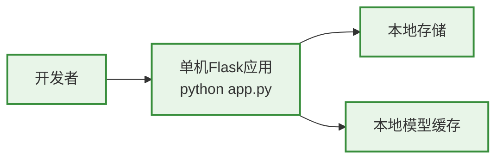
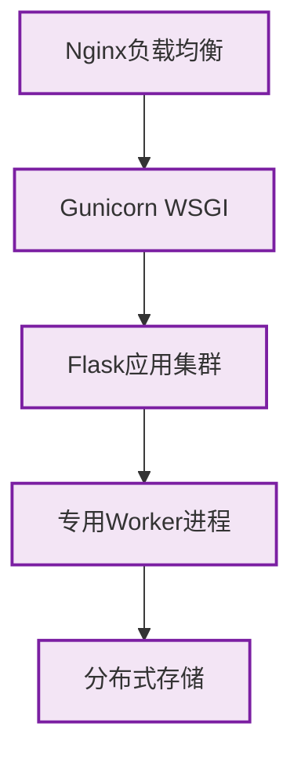

# 统一水印工具 - 部署架构

## 部署架构图

```mermaid
graph TB
    %% 用户层
    subgraph "用户层 (User Layer)"
        WEB_USER[Web用户]
        API_USER[API用户/开发者]
        MOBILE[移动端用户]
    end

    %% 负载均衡层
    subgraph "负载均衡层 (Load Balancer)"
        LB[Nginx/Apache<br/>负载均衡器]
        SSL[SSL终端]
    end

    %% 应用服务层
    subgraph "应用服务层 (Application Server Layer)"
        subgraph "Flask应用集群"
            APP1[Flask App 1<br/>app.py]
            APP2[Flask App 2<br/>app.py]  
            APP3[Flask App N<br/>app.py]
        end
        
        subgraph "Web服务器"
            GUNICORN[Gunicorn WSGI服务器]
            STATIC_SERVER[静态文件服务器]
        end
    end

    %% 计算资源层
    subgraph "计算资源层 (Compute Resources)"
        subgraph "CPU密集型服务"
            CPU_WORKER1[CPU Worker 1<br/>文本/音频处理]
            CPU_WORKER2[CPU Worker 2<br/>预处理任务]
        end
        
        subgraph "GPU密集型服务"
            GPU_WORKER1[GPU Worker 1<br/>图像生成/水印]
            GPU_WORKER2[GPU Worker 2<br/>视频生成/水印]
            GPU_WORKER3[GPU Worker N<br/>深度学习推理]
        end
    end

    %% 存储层
    subgraph "存储层 (Storage Layer)"
        subgraph "模型存储"
            MODEL_CACHE[HuggingFace模型缓存<br/>~/.cache/huggingface]
            LOCAL_MODELS[本地模型存储<br/>/models/]
            CHECKPOINT_STORE[检查点存储<br/>/ckpts/]
        end
        
        subgraph "数据存储"
            TEMP_STORAGE[临时文件存储<br/>/tmp/]
            OUTPUT_STORAGE[输出文件存储<br/>/demo_outputs/]
            UPLOAD_STORAGE[上传文件存储<br/>/demo_uploads/]
        end
        
        subgraph "配置存储"
            CONFIG_FILES[配置文件<br/>/config/]
            CANDIDATE_DB[候选消息数据库<br/>candidate_messages.json]
        end
    end

    %% 基础设施层
    subgraph "基础设施层 (Infrastructure Layer)"
        subgraph "容器化平台"
            DOCKER[Docker容器]
            K8S[Kubernetes集群]
        end
        
        subgraph "监控系统"
            PROMETHEUS[Prometheus监控]
            GRAFANA[Grafana仪表板]
            LOG_SYSTEM[日志系统]
        end
        
        subgraph "缓存系统"
            REDIS[Redis缓存]
            MEMCACHED[Memcached]
        end
    end

    %% 外部依赖
    subgraph "外部依赖 (External Dependencies)"
        HF_HUB[HuggingFace Hub<br/>hf-mirror.com]
        CDN[CDN静态资源]
        DNS[DNS服务]
    end

    %% 连接关系
    WEB_USER --> LB
    API_USER --> LB
    MOBILE --> LB
    
    LB --> SSL
    SSL --> GUNICORN
    
    GUNICORN --> APP1
    GUNICORN --> APP2
    GUNICORN --> APP3
    
    APP1 --> CPU_WORKER1
    APP1 --> GPU_WORKER1
    APP2 --> CPU_WORKER2
    APP2 --> GPU_WORKER2
    APP3 --> GPU_WORKER3
    
    CPU_WORKER1 --> MODEL_CACHE
    CPU_WORKER2 --> LOCAL_MODELS
    GPU_WORKER1 --> MODEL_CACHE
    GPU_WORKER2 --> CHECKPOINT_STORE
    GPU_WORKER3 --> LOCAL_MODELS
    
    APP1 --> OUTPUT_STORAGE
    APP2 --> TEMP_STORAGE
    APP3 --> UPLOAD_STORAGE
    
    APP1 --> CONFIG_FILES
    APP2 --> CANDIDATE_DB
    
    GUNICORN --> STATIC_SERVER
    STATIC_SERVER --> CDN
    
    APP1 --> REDIS
    APP2 --> REDIS
    APP3 --> REDIS
    
    PROMETHEUS --> APP1
    PROMETHEUS --> APP2
    PROMETHEUS --> APP3
    GRAFANA --> PROMETHEUS
    
    MODEL_CACHE --> HF_HUB
    
    %% Docker容器化
    APP1 -.-> DOCKER
    APP2 -.-> DOCKER
    APP3 -.-> DOCKER
    CPU_WORKER1 -.-> DOCKER
    CPU_WORKER2 -.-> DOCKER
    GPU_WORKER1 -.-> DOCKER
    GPU_WORKER2 -.-> DOCKER
    GPU_WORKER3 -.-> DOCKER
    
    %% K8s编排
    DOCKER -.-> K8S

    %% 样式定义
    classDef userLayer fill:#e3f2fd,stroke:#1976d2,stroke-width:2px
    classDef balancerLayer fill:#e8f5e8,stroke:#388e3c,stroke-width:2px
    classDef appLayer fill:#fff3e0,stroke:#f57c00,stroke-width:2px
    classDef computeLayer fill:#f3e5f5,stroke:#7b1fa2,stroke-width:2px
    classDef storageLayer fill:#e1f5fe,stroke:#0277bd,stroke-width:2px
    classDef infraLayer fill:#f1f8e9,stroke:#558b2f,stroke-width:2px
    classDef externalLayer fill:#ffebee,stroke:#d32f2f,stroke-width:2px

    class WEB_USER,API_USER,MOBILE userLayer
    class LB,SSL balancerLayer
    class APP1,APP2,APP3,GUNICORN,STATIC_SERVER appLayer
    class CPU_WORKER1,CPU_WORKER2,GPU_WORKER1,GPU_WORKER2,GPU_WORKER3 computeLayer
    class MODEL_CACHE,LOCAL_MODELS,CHECKPOINT_STORE,TEMP_STORAGE,OUTPUT_STORAGE,UPLOAD_STORAGE,CONFIG_FILES,CANDIDATE_DB storageLayer
    class DOCKER,K8S,PROMETHEUS,GRAFANA,LOG_SYSTEM,REDIS,MEMCACHED infraLayer
    class HF_HUB,CDN,DNS externalLayer
```



## 部署模式详细说明

### 1. 开发模式部署 (Development Mode)



**特点**:
- 单机部署，快速启动
- 使用Flask开发服务器
- 本地文件存储
- 适合功能开发和测试

**配置要求**:
- Python 3.8+
- CUDA支持的GPU (推荐)
- 至少16GB RAM
- 100GB+ 磁盘空间(模型存储)

### 2. 生产模式部署 (Production Mode)



**特点**:
- 多进程并发处理
- 负载均衡和高可用
- 分布式文件存储
- 监控和日志系统

**配置要求**:
- 多台服务器集群
- 专用GPU服务器
- 网络文件系统(NFS/GlusterFS)
- Redis集群缓存

### 3. 容器化部署 (Containerized Deployment)

```yaml
# docker-compose.yml 示例
version: '3.8'
services:
  web:
    build: .
    ports:
      - "5000:5000"
    environment:
      - FLASK_ENV=production
    volumes:
      - ./models:/app/models
      - ./outputs:/app/demo_outputs
    depends_on:
      - redis
      
  worker-cpu:
    build: .
    command: celery worker -A app.celery --loglevel=info --concurrency=4
    volumes:
      - ./models:/app/models
    depends_on:
      - redis
      
  worker-gpu:
    build: .
    runtime: nvidia
    command: celery worker -A app.celery --loglevel=info --concurrency=2
    environment:
      - NVIDIA_VISIBLE_DEVICES=all
    volumes:
      - ./models:/app/models
    depends_on:
      - redis
      
  redis:
    image: redis:alpine
    ports:
      - "6379:6379"
```

### 4. Kubernetes部署 (K8s Deployment)

```yaml
# k8s-deployment.yaml 示例
apiVersion: apps/v1
kind: Deployment
metadata:
  name: watermark-tool
spec:
  replicas: 3
  selector:
    matchLabels:
      app: watermark-tool
  template:
    metadata:
      labels:
        app: watermark-tool
    spec:
      containers:
      - name: web
        image: watermark-tool:latest
        ports:
        - containerPort: 5000
        resources:
          requests:
            memory: "2Gi"
            cpu: "500m"
          limits:
            memory: "4Gi"
            cpu: "2000m"
        volumeMounts:
        - name: models
          mountPath: /app/models
        - name: outputs  
          mountPath: /app/demo_outputs
      volumes:
      - name: models
        persistentVolumeClaim:
          claimName: models-pvc
      - name: outputs
        persistentVolumeClaim:
          claimName: outputs-pvc
---
apiVersion: v1
kind: Service
metadata:
  name: watermark-tool-service
spec:
  selector:
    app: watermark-tool
  ports:
    - protocol: TCP
      port: 80
      targetPort: 5000
  type: LoadBalancer
```

## 资源配置建议

### 最小配置 (开发/测试)
```yaml
硬件要求:
  CPU: 4核心
  RAM: 16GB
  GPU: GTX 1060 6GB (可选)
  存储: 100GB SSD
  
软件要求:
  OS: Ubuntu 20.04+/CentOS 8+
  Python: 3.8+
  CUDA: 11.8+ (如使用GPU)
  Docker: 20.10+ (容器化部署)
```

### 推荐配置 (生产环境)
```yaml
Web服务器:
  CPU: 8核心
  RAM: 32GB
  存储: 200GB SSD
  数量: 2台 (高可用)

GPU计算服务器:
  CPU: 16核心
  RAM: 64GB
  GPU: RTX 4090 24GB × 2
  存储: 1TB NVMe SSD
  数量: 2-4台

存储服务器:
  CPU: 8核心  
  RAM: 32GB
  存储: 10TB HDD RAID10
  数量: 2台 (主备)
```

### 高性能配置 (企业级)
```yaml
负载均衡器:
  CPU: 8核心
  RAM: 16GB
  网络: 10Gbps
  数量: 2台 (主备)

应用服务器集群:
  CPU: 16核心
  RAM: 64GB
  存储: 500GB SSD
  数量: 4-8台

GPU计算集群:
  CPU: 32核心
  RAM: 128GB
  GPU: A100 80GB × 4
  存储: 2TB NVMe SSD
  数量: 4-8台

分布式存储:
  存储: 50TB 分布式文件系统
  备份: 3副本冗余
  性能: 1GB/s 读写速度
```

## 监控和运维

### 1. 性能监控指标
- **系统指标**: CPU使用率、内存使用率、磁盘I/O、网络流量
- **应用指标**: 请求响应时间、并发用户数、任务完成率
- **GPU指标**: GPU使用率、显存占用、温度监控
- **业务指标**: 水印嵌入成功率、提取准确率、用户满意度

### 2. 告警规则
```yaml
告警配置:
  CPU使用率超过80%: 警告
  内存使用率超过85%: 警告  
  磁盘空间不足20%: 严重
  GPU温度超过85°C: 严重
  任务失败率超过5%: 警告
  响应时间超过30秒: 警告
```

### 3. 日志管理
- **应用日志**: Flask应用运行日志，包含请求记录、错误信息
- **任务日志**: 水印处理任务的详细执行日志
- **系统日志**: 系统级别的运行状态和错误日志
- **审计日志**: 用户操作记录和安全相关日志

### 4. 备份策略
- **模型备份**: 每周备份模型文件到远程存储
- **数据备份**: 每日备份用户数据和配置文件
- **配置备份**: 每次配置变更后自动备份
- **系统快照**: 每月创建系统完整快照

这个部署架构确保了系统的可扩展性、高可用性和运维便利性，能够满足从开发测试到生产环境的各种部署需求。