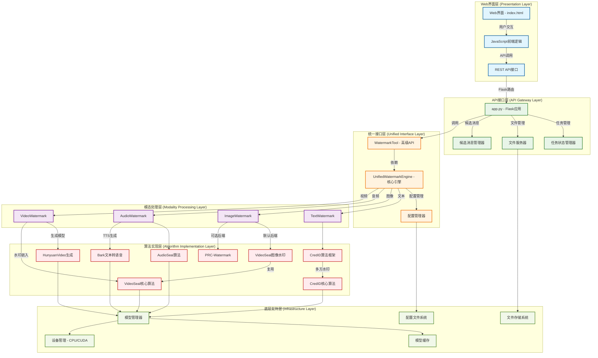

# 统一水印工具 - 系统整体架构

## 系统整体架构图

## 架构层次说明

### 1. Web界面层 (Presentation Layer)
- **Web界面 (index.html)**: 统一的多模态水印操作界面
- **JavaScript前端逻辑**: 处理用户交互、模态切换、实时状态更新
- **REST API接口**: 前后端通信桥梁

### 2. API接口层 (API Gateway Layer)  
- **Flask应用 (app.py)**: Web服务器和API路由管理
- **任务状态管理器**: 跟踪水印处理任务的实时状态
- **文件服务器**: 处理文件上传、下载和存储
- **候选消息管理器**: 管理水印消息用于提取时的智能匹配

### 3. 统一接口层 (Unified Interface Layer)
- **WatermarkTool**: 高级API封装，向后兼容的用户接口
- **UnifiedWatermarkEngine**: 核心引擎，协调所有模态的水印操作
- **配置管理器**: 统一管理各模态的配置参数

### 4. 模态处理层 (Modality Processing Layer)
- **TextWatermark**: 文本水印处理器（仅AI生成模式）
- **ImageWatermark**: 图像水印处理器（双模式：AI生成+文件上传）
- **AudioWatermark**: 音频水印处理器（双模式：TTS生成+文件上传）
- **VideoWatermark**: 视频水印处理器（双模式：AI生成+文件上传）

### 5. 算法实现层 (Algorithm Implementation Layer)
- **CredID**: 多方文本水印算法框架
- **VideoSeal**: 通用视频水印算法（支持图像和视频）
- **AudioSeal**: 深度学习音频水印算法
- **PRC-Watermark**: 可选的图像水印算法
- **HunyuanVideo**: AI视频生成模型
- **Bark TTS**: 文本转语音生成模型

### 6. 底层支持层 (Infrastructure Layer)
- **模型管理器**: 统一的深度学习模型加载和管理
- **模型缓存**: 本地模型存储和缓存策略
- **设备管理**: CPU/CUDA设备自适应分配
- **文件存储系统**: 多媒体文件的存储和访问
- **配置文件系统**: YAML配置文件的解析和管理

## 核心设计原则

1. **模块化设计**: 每个模态独立实现，便于维护和扩展
2. **双模式支持**: AI生成模式和文件上传模式无缝切换
3. **离线优先**: 优先使用本地缓存模型，减少网络依赖
4. **懒加载机制**: 按需初始化组件，优化内存使用
5. **统一配置**: 集中化配置管理，支持参数优化
6. **原文件保存**: 自动保存原文件和水印文件用于对比显示