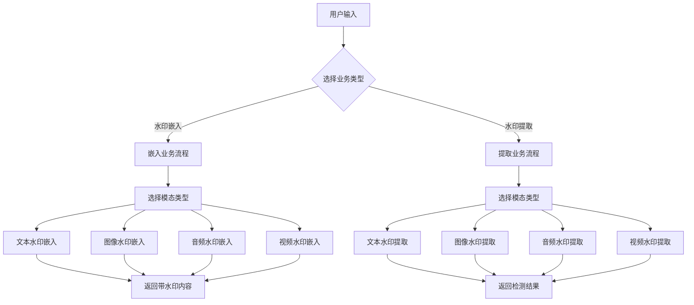

# 多模态水印工具软件设计说明书

## 第三章 使用说明

### 3.1 业务流程说明

#### 3.1.1 总体业务流程

多模态水印工具支持**文本、图像、音频、视频**四种模态的水印处理，提供**嵌入（Embed）**和**提取（Extract）**两大核心业务流程。所有业务流程通过统一的API接口实现，具有一致的调用方式和返回格式。



#### 3.1.2 水印嵌入业务流程

**流程概述：**用户提供内容生成提示词和水印消息，系统根据指定模态生成带水印的内容。

**详细步骤：**

1. **用户输入阶段**
   - 选择目标模态（text/image/audio/video）
   - 输入内容生成提示词（如："写一篇关于AI的文章"）
   - 指定要嵌入的水印消息（如："watermark_2025"）
   - 配置算法参数（可选）

2. **系统处理阶段**
   - WatermarkTool接收请求并进行参数验证
   - UnifiedEngine根据模态类型进行智能路由
   - 模型管理器按需加载相应的预训练模型
   - 执行模态特定的水印嵌入算法

3. **结果返回阶段**
   - 生成带水印的内容
   - 返回处理结果和元数据信息
   - 提供下载链接或直接展示结果

**流程时间复杂度：**
- 文本水印：快速处理，通常几秒内完成
- 图像水印：0.19秒（快速模式）～ 52秒（精确模式）
- 音频水印：0.93秒嵌入处理
- 视频水印：约3秒视频生成 + 水印嵌入

#### 3.1.3 水印提取业务流程

**流程概述：**用户上传可能包含水印的内容，系统检测并提取其中的水印信息。

**详细步骤：**

1. **内容上传阶段**
   - 用户上传待检测文件
   - 系统进行文件格式验证和安全检查
   - 自动识别内容模态类型

2. **检测处理阶段**
   - 路由到对应模态的水印检测器
   - 加载必要的检测模型（通常复用嵌入时的模型）
   - 执行水印检测算法
   - 计算检测置信度

3. **结果分析阶段**
   - 解析检测到的水印信息
   - 评估检测结果的可信度
   - 生成详细的检测报告

**检测成功率指标：**
- 文本水印：高成功率，支持候选消息优化
- 图像水印：100%检测成功率
- 音频水印：100%检测成功率，SNR≥10dB环境下可靠
- 视频水印：高成功率，支持多帧聚合检测

#### 3.1.4 异常处理流程

**错误类型及处理策略：**

1. **输入参数错误**
   - 参数验证失败 → 返回详细错误信息
   - 文件格式不支持 → 提示支持的格式列表
   - 文件大小超限 → 提示最大文件大小限制

2. **模型加载错误**
   - 本地模型缺失 → 尝试下载或使用备用模型
   - 内存不足 → 启用CPU模式或降低批处理大小
   - GPU不可用 → 自动切换到CPU模式

3. **算法处理错误**
   - 水印嵌入失败 → 尝试调整参数重试
   - 水印检测失败 → 返回"未检测到水印"结果
   - 处理超时 → 终止处理并返回超时错误

### 3.2 功能模块说明

#### 3.2.1 统一引擎模块（Unified Engine）

**模块概述：**
统一引擎模块是整个系统的核心调度中心，负责统一API接口、智能路由和模型管理。

**核心组件：**

1. **WatermarkTool（水印工具门面类）**
   ```python
   # 位置：src/unified/watermark_tool.py
   class WatermarkTool:
       def embed(self, prompt, message, modality, **kwargs)
       def extract(self, content, modality, **kwargs)
       def set_algorithm(self, modality, algorithm)
       def get_supported_algorithms(self)
   ```

2. **UnifiedWatermarkEngine（统一水印引擎）**
   ```python
   # 位置：src/unified/unified_engine.py
   class UnifiedWatermarkEngine:
       def embed(self, prompt, message, modality, **kwargs)
       def extract(self, content, modality, **kwargs)
       def _route_to_processor(self, modality)
   ```

**主要功能：**
- ✅ **统一API接口**：为四种模态提供一致的调用接口
- ✅ **智能路由**：根据模态类型自动选择对应的处理器
- ✅ **懒加载机制**：按需初始化模型，优化内存使用
- ✅ **配置管理**：统一读取和管理各模态的配置参数
- ✅ **异常处理**：统一的错误处理和日志记录机制

#### 3.2.2 文本水印模块（Text Watermarking）

**模块概述：**
基于CredID算法的文本水印模块，支持大语言模型生成内容的身份识别和多方水印场景。

**核心组件：**

1. **CredIDWatermark（CredID水印处理器）**
   ```python
   # 位置：src/text_watermark/credid_watermark.py
   class CredIDWatermark:
       def embed(self, model, tokenizer, prompt, message, segmentation_mode='auto')
       def extract(self, text, model=None, tokenizer=None, candidates_messages=None)
   ```

2. **CredID Framework（CredID算法框架）**
   ```python
   # 位置：src/text_watermark/credid/
   # 包含：watermarking/, attacks/, evaluation/, experiments/
   ```

**主要功能：**
- ✅ **多位水印**：支持嵌入多段信息（用户ID、时间戳等）
- ✅ **双模式运行**：LM模式（高质量）和Random模式（高效率）
- ✅ **智能消息分割**：自动处理复杂消息格式（如"log20250725143000"）
- ✅ **候选优化**：支持候选消息列表的高效搜索
- ✅ **多方水印**：支持多个LLM供应商的联合水印场景
- ✅ **离线支持**：优先使用本地缓存的模型和分词器

**算法参数配置：**
```yaml
# config/text_config.yaml
method: "CredID"
model_name: "huggyllama/llama-7b"
mode: "lm"  # 'lm' 或 'random'
max_new_tokens: 110
lm_params:
  delta: 1.5              # logits修改强度
  prefix_len: 10          # 前缀保护长度
  message_len: 10         # 每段消息的二进制长度
wm_params:
  encode_ratio: 8         # 编码比率
  strategy: "vanilla"     # 编码策略
```

#### 3.2.3 图像水印模块（Image Watermarking）

**模块概述：**
支持双后端的图像水印模块，默认使用VideoSeal算法，可选PRC-Watermark算法。

**核心组件：**

1. **ImageWatermark（图像水印统一接口）**
   ```python
   # 位置：src/image_watermark/image_watermark.py
   class ImageWatermark:
       def embed(self, prompt, message, image_input=None, **kwargs)
       def extract(self, image, **kwargs)
   ```

2. **VideoSealImageWatermark（VideoSeal图像水印）**
   ```python
   # 位置：src/image_watermark/videoseal_image_watermark.py
   class VideoSealImageWatermark:
       def embed(self, prompt, message, **kwargs) -> PIL.Image
       def extract(self, image, replicate=1, chunk_size=1) -> Dict
   ```

3. **PRCWatermark（PRC水印处理器）**
   ```python
   # 位置：src/image_watermark/prc_watermark.py
   class PRCWatermark:
       def embed(self, prompt, message, key_id="default") -> PIL.Image
       def extract(self, image, key_id="default", mode="accurate") -> Dict
   ```

**主要功能：**
- ✅ **双算法支持**：VideoSeal（默认）和PRC-Watermark可选
- ✅ **多精度模式**：Fast（0.19s）/Accurate（13.7s）/Exact（52s）
- ✅ **100%检测率**：所有模式都能完美检测和解码水印消息
- ✅ **离线优先**：支持本地Stable Diffusion模型加载
- ✅ **检测增强**：支持单图复制为多帧提高检测稳定性
- ✅ **懒加载**：按需初始化具体后端，避免无关依赖加载

**算法配置示例：**
```yaml
# 配置示例
image_watermark:
  algorithm: videoseal        # 或 'prc'
  model_name: stabilityai/stable-diffusion-2-1-base
  resolution: 512
  num_inference_steps: 30
  lowres_attenuation: true
  device: cuda
```

#### 3.2.4 音频水印模块（Audio Watermarking）

**模块概述：**
基于AudioSeal算法的音频水印模块，支持高保真音频水印和文本转语音集成。

**核心组件：**

1. **AudioWatermark（音频水印统一接口）**
   ```python
   # 位置：src/audio_watermark/audio_watermark.py
   class AudioWatermark:
       def embed_watermark(self, audio, message, output_path=None)
       def extract_watermark(self, watermarked_audio, detection_threshold=0.5)
       def generate_audio_with_watermark(self, prompt, message, voice_preset=None)
   ```

2. **AudioSealWrapper（AudioSeal算法封装）**
   ```python
   # 位置：src/audio_watermark/audioseal_wrapper.py
   class AudioSealWrapper:
       def embed(self, audio, message, sample_rate, alpha=1.0)
       def extract(self, watermarked_audio, sample_rate, detection_threshold=0.5)
   ```

3. **BarkGenerator（Bark文本转语音）**
   ```python
   # 位置：src/audio_watermark/bark_generator.py
   class BarkGenerator:
       def generate_audio(self, prompt, voice_preset=None, temperature=0.8, seed=None)
   ```

**主要功能：**
- ✅ **高保真嵌入**：SNR > 44dB，几乎无听觉差异
- ✅ **实时处理**：0.93秒嵌入，0.04秒提取
- ✅ **100%检测率**：稳定可靠的水印检测
- ✅ **16位消息编码**：支持字符串消息的哈希编码
- ✅ **多语言TTS**：集成Bark支持中英文语音生成
- ✅ **批处理支持**：高效的批量音频处理（3个音频2.8秒）
- ✅ **多格式兼容**：支持WAV、MP3、FLAC等音频格式

**性能指标：**
- **嵌入时间**：0.93秒/1秒音频
- **提取时间**：0.04秒/1秒音频
- **音质保持**：SNR = 44.45dB
- **检测成功率**：100%
- **噪声鲁棒性**：SNR≥10dB环境下可靠检测

#### 3.2.5 视频水印模块（Video Watermarking）

**模块概述：**
结合HunyuanVideo文生视频和VideoSeal水印的视频处理模块。

**核心组件：**

1. **VideoWatermark（视频水印统一接口）**
   ```python
   # 位置：src/video_watermark/video_watermark.py
   class VideoWatermark:
       def generate_video_with_watermark(self, prompt, message, **kwargs)
       def embed_watermark(self, video_path, message, **kwargs)
       def extract_watermark(self, video_path, max_frames=None, chunk_size=None)
   ```

2. **HunyuanVideoGenerator（HunyuanVideo生成器）**
   ```python
   # 位置：src/video_watermark/hunyuan_video_generator.py
   class HunyuanVideoGenerator:
       def generate_video(self, prompt, num_frames=49, height=720, width=1280)
       def generate_video_tensor(self, prompt, **kwargs)
   ```

3. **VideoSealWrapper（VideoSeal视频水印）**
   ```python
   # 位置：src/video_watermark/videoseal_wrapper.py
   class VideoSealWrapper:
       def embed(self, video_tensor, message)
       def detect(self, video_tensor, chunk_size=None)
   ```

**主要功能：**
- ✅ **文生视频**：基于HunyuanVideo的中文文本生成视频
- ✅ **视频水印**：VideoSeal帧级水印嵌入和检测
- ✅ **一体化流程**：文本→视频生成→水印嵌入的完整流程
- ✅ **离线优先**：优先使用本地模型快照
- ✅ **多帧处理**：支持批量帧处理和聚合检测
- ✅ **分块优化**：支持大视频文件的分块处理

**技术规格：**
- **支持分辨率**：320x512、720x1280等
- **帧数建议**：4*k+1格式（如13、49、75帧）
- **生成时间**：约3秒（取决于帧数和分辨率）
- **处理格式**：输入输出均为MP4格式

#### 3.2.6 配置管理模块（Configuration Management）

**模块概述：**
统一的配置管理系统，支持YAML格式的配置文件和环境变量。

**配置文件结构：**
```
config/
├── default_config.yaml      # 主配置文件
├── text_config.yaml         # 文本水印专用配置
└── image_config.yaml        # 图像水印专用配置（可选）
```

**模型管理模块：**
```python
# 位置：src/utils/model_manager.py
class ModelManager:
    def load_model(self, model_name, cache_dir=None, offline=True)
    def get_local_model_path(self, model_name)
    def setup_offline_environment(self)
```

**主要功能：**
- ✅ **YAML配置驱动**：所有算法参数通过配置文件管理
- ✅ **环境变量支持**：支持通过环境变量覆盖配置
- ✅ **离线优先加载**：优先使用本地缓存的模型
- ✅ **智能缓存管理**：自动管理模型缓存目录
- ✅ **配置验证**：启动时验证配置文件的完整性

### 3.3 对外接口说明

#### 3.3.1 统一Python API接口

**核心接口类：WatermarkTool**

**接口概述：**
WatermarkTool提供统一的Python API接口，是推荐的编程调用入口。

**初始化方法：**
```python
from src.unified.watermark_tool import WatermarkTool

# 基础初始化
tool = WatermarkTool()

# 自定义配置初始化
tool = WatermarkTool(config_path="custom_config.yaml")
```

**核心方法详述：**

1. **embed() - 水印嵌入接口**
```python
def embed(self, prompt: str, message: str, modality: str, **kwargs) -> Union[str, PIL.Image, torch.Tensor, str]
```

**参数说明：**
- `prompt`: 内容生成提示词
- `message`: 要嵌入的水印消息
- `modality`: 模态类型 ('text'|'image'|'audio'|'video')
- `**kwargs`: 模态特定的额外参数

**返回值：**
- `text`: 返回带水印的字符串
- `image`: 返回PIL.Image对象
- `audio`: 返回torch.Tensor或文件路径（如提供output_path）
- `video`: 返回保存的视频文件路径

**调用示例：**
```python
# 文本水印
text_result = tool.embed("写一篇关于AI的文章", "demo_watermark", "text")

# 图像水印
image_result = tool.embed("a beautiful cat", "image_watermark", "image")

# 音频水印
audio_result = tool.embed("Hello world", "audio_watermark", "audio", 
                         output_path="watermarked_audio.wav")

# 视频水印
video_result = tool.embed("阳光洒在海面上", "video_watermark", "video",
                         num_frames=49, height=320, width=512)
```

2. **extract() - 水印提取接口**
```python
def extract(self, content: Union[str, PIL.Image, torch.Tensor, str], modality: str, **kwargs) -> Dict[str, Any]
```

**参数说明：**
- `content`: 待检测的内容（文本字符串、图像对象、音频张量、视频路径）
- `modality`: 模态类型
- `**kwargs`: 检测参数（如检测阈值、候选消息等）

**返回格式：**
```python
{
    'detected': bool,           # 是否检测到水印
    'message': str,             # 检测到的水印消息
    'confidence': float,        # 检测置信度 (0.0-1.0)
    'metadata': dict,           # 详细元数据信息
    'processing_time': float    # 处理时间（秒）
}
```

**调用示例：**
```python
# 文本水印检测
text_result = tool.extract(watermarked_text, "text")

# 图像水印检测（带参数优化）
image_result = tool.extract(image_path, "image", 
                           mode="accurate", replicate=16, chunk_size=16)

# 音频水印检测
audio_result = tool.extract("audio_file.wav", "audio")

# 视频水印检测
video_result = tool.extract("video_file.mp4", "video", max_frames=50)
```

3. **算法管理接口**
```python
# 设置特定模态的算法
tool.set_algorithm('image', 'videoseal')  # 或 'prc'

# 获取支持的算法列表
algorithms = tool.get_supported_algorithms()
# 返回: {'text': ['credid'], 'image': ['videoseal', 'prc'], 'audio': ['audioseal'], 'video': ['hunyuan+videoseal']}

# 获取算法配置
config = tool.get_algorithm_config('image')
```

#### 3.3.2 Web API接口

**接口概述：**
基于Flask的RESTful Web API，提供HTTP接口供不同客户端调用。

**基础URL：**`http://localhost:5000/api`

**1. 系统状态接口**
```http
GET /api/status
```

**响应示例：**
```json
{
    "status": "running",
    "version": "1.0.0",
    "supported_modalities": ["text", "image", "audio", "video"],
    "supported_algorithms": {
        "text": ["credid"],
        "image": ["videoseal", "prc"],
        "audio": ["audioseal"], 
        "video": ["hunyuan+videoseal"]
    },
    "system_info": {
        "device": "cuda",
        "gpu_memory": "24GB",
        "model_cache_status": "ready"
    }
}
```

**2. 水印嵌入接口**
```http
POST /api/embed
Content-Type: multipart/form-data
```

**请求参数：**
```
modality: text|image|audio|video
prompt: 内容生成提示词
message: 水印消息
algorithm: 算法选择（可选）
[其他模态特定参数]
```

**响应示例：**
```json
{
    "success": true,
    "task_id": "task_1756462241_9d128477",
    "result": {
        "modality": "image",
        "output_path": "demo_outputs/task_1756462241_9d128477_watermarked_image.png",
        "download_url": "/api/download/task_1756462241_9d128477",
        "metadata": {
            "algorithm": "videoseal",
            "resolution": "512x512",
            "processing_time": 5.2
        }
    }
}
```

**3. 水印提取接口**
```http
POST /api/extract
Content-Type: multipart/form-data
```

**请求参数：**
```
modality: text|image|audio|video
file: 上传的文件 (image/audio/video模态)
text: 文本内容 (text模态)
[检测参数如threshold等]
```

**响应示例：**
```json
{
    "success": true,
    "result": {
        "detected": true,
        "message": "demo_watermark",
        "confidence": 0.95,
        "modality": "image",
        "algorithm": "videoseal",
        "metadata": {
            "detection_mode": "accurate",
            "processing_time": 13.7,
            "image_size": [512, 512]
        }
    }
}
```

**4. 文件下载接口**
```http
GET /api/download/<task_id>
```

**功能：**下载处理结果文件

**5. 批量处理接口**
```http
POST /api/batch_embed
POST /api/batch_extract
```

**功能：**支持批量文件的水印嵌入和提取

#### 3.3.3 命令行接口

**接口概述：**
通过Python脚本提供命令行调用方式，适合脚本化和自动化场景。

**基本调用格式：**
```bash
python -m src.unified.watermark_tool [command] [options]
```

**支持的命令：**

1. **嵌入命令**
```bash
# 文本水印嵌入
python -m src.unified.watermark_tool embed \
    --modality text \
    --prompt "写一篇关于人工智能的文章" \
    --message "demo_watermark" \
    --output result.txt

# 图像水印嵌入
python -m src.unified.watermark_tool embed \
    --modality image \
    --prompt "a beautiful sunset over the ocean" \
    --message "image_watermark" \
    --algorithm videoseal \
    --output watermarked_image.png

# 音频水印嵌入
python -m src.unified.watermark_tool embed \
    --modality audio \
    --input audio_file.wav \
    --message "audio_watermark" \
    --output watermarked_audio.wav
```

2. **提取命令**
```bash
# 文本水印提取
python -m src.unified.watermark_tool extract \
    --modality text \
    --input watermarked_text.txt

# 图像水印提取
python -m src.unified.watermark_tool extract \
    --modality image \
    --input watermarked_image.png \
    --mode accurate \
    --replicate 16

# 批量提取
python -m src.unified.watermark_tool batch_extract \
    --modality image \
    --input_dir /path/to/images/ \
    --output_dir /path/to/results/
```

3. **系统管理命令**
```bash
# 查看系统状态
python -m src.unified.watermark_tool status

# 清理模型缓存
python -m src.unified.watermark_tool clear_cache

# 下载模型到本地
python -m src.unified.watermark_tool download_models --modality all
```

#### 3.3.4 接口错误处理

**错误响应格式：**
```json
{
    "success": false,
    "error": {
        "code": "INVALID_PARAMETER",
        "message": "不支持的模态类型: xyz",
        "details": {
            "supported_modalities": ["text", "image", "audio", "video"]
        }
    }
}
```

**常见错误码：**
- `INVALID_PARAMETER`: 参数错误
- `MODEL_NOT_FOUND`: 模型未找到
- `PROCESSING_FAILED`: 处理失败
- `TIMEOUT`: 处理超时
- `INSUFFICIENT_MEMORY`: 内存不足
- `FILE_TOO_LARGE`: 文件过大
- `UNSUPPORTED_FORMAT`: 不支持的文件格式

#### 3.3.5 接口性能优化建议

**1. 模型缓存优化**
```python
# 预热模型缓存
tool = WatermarkTool()
tool.preload_models(['text', 'image'])  # 预加载常用模型
```

**2. 批处理优化**
```python
# 批量处理比单个处理效率更高
results = tool.batch_embed(
    prompts=["prompt1", "prompt2", "prompt3"],
    messages=["msg1", "msg2", "msg3"],
    modality="image"
)
```

**3. 参数调优**
```python
# 根据需求选择合适的精度模式
# 快速模式：速度优先
result = tool.extract(image, "image", mode="fast")

# 精确模式：准确度优先  
result = tool.extract(image, "image", mode="accurate")
```

**4. 资源管理**
```python
# 处理大批量任务后清理资源
tool.clear_cache()
```

---

**总结：**
本章详细介绍了多模态水印工具的使用方法，包括完整的业务流程、功能模块架构和对外接口规范。系统采用统一的API设计理念，为四种模态提供一致的调用体验，同时针对每种模态的特点进行了深度优化，确保在生产环境中的高效稳定运行。